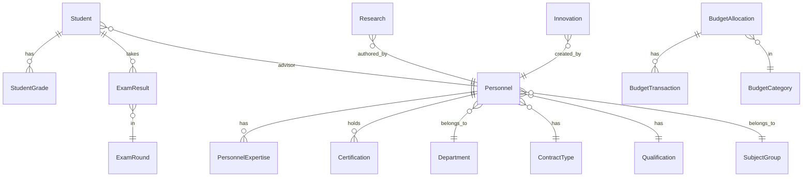

# ระบบสถิติสำนักพยาบาล (Nursing Bureau Statistics System)

ระบบจัดการข้อมูลสถิติสำนักพยาบาล พัฒนาด้วย [Yii 2 Framework](https://www.yiiframework.com/) สำหรับบริหารจัดการข้อมูลนักศึกษา บุคลากร ผลสอบ งานวิจัย นวัตกรรม งบประมาณ และบริการวิชาการ

## ✨ ฟีเจอร์หลัก

| โมดูล | รายละเอียด |
|---|---|
| **แดชบอร์ด** | แสดงภาพรวมสถิติบุคลากร KPI นักศึกษา แผนที่ และกราฟเชิงวิเคราะห์ |
| **นักศึกษา** | จัดการข้อมูลนักศึกษา รุ่น/ปีที่เข้า อาจารย์ที่ปรึกษา และปีที่จบ |
| **เกรดนักศึกษา** | บันทึกและติดตามผลการเรียน (GPAX) |
| **ผลสอบใบประกอบวิชาชีพ** | ติดตามผลสอบ สอบผ่าน/ไม่ผ่าน แยกตามรอบสอบและวิชา |
| **บุคลากร** | จัดการข้อมูลบุคลากร สายวิชาการ/สายปฏิบัติการ ตำแหน่ง ใบประกอบวิชาชีพ |
| **ความเชี่ยวชาญ** | บันทึกความเชี่ยวชาญของบุคลากร |
| **ใบรับรอง** | จัดการใบรับรองและระดับใบรับรองของบุคลากร |
| **ทุนการศึกษา** | จัดการข้อมูลทุนการศึกษา |
| **วิจัย** | จัดการข้อมูลงานวิจัย แนบไฟล์ ค้นหาและกรองข้อมูล |
| **นวัตกรรม** | จัดการข้อมูลนวัตกรรม แนบไฟล์ |
| **บริการวิชาการ** | จัดการข้อมูลบริการวิชาการ |
| **งบประมาณ** | จัดการข้อมูลงบประมาณ การจัดสรร และการเบิกจ่าย |
| **แผนรับสมัคร** | จัดการแผนรับสมัครนักศึกษาสายวิชาการ |
| **กลุ่มวิชา** | จัดการกลุ่มวิชาสำหรับจัดหมวดหมู่บุคลากร |

## 🛠 เทคโนโลยี

- **Framework:** Yii 2.0 (PHP ≥ 7.4)
- **Database:** MySQL (charset `utf8mb4`)
- **Frontend:** Bootstrap 5 (yii2-bootstrap5)
- **Spreadsheet:** PhpSpreadsheet (import/export Excel)
- **Testing:** Codeception
- **ภาษา:** Thai (th)

## 📁 โครงสร้างโปรเจค

```
assets/             Asset bundles (CSS/JS)
commands/           Console commands
config/             การตั้งค่าแอปพลิเคชัน (db, web, params)
controllers/        Web controllers (20 controllers)
mail/               View files สำหรับอีเมล
migrations/         Database migrations (44 migrations)
models/             Model classes (34 models)
views/              View files (21 modules)
web/                Entry script และ static resources
widgets/            Custom widgets
tests/              Unit, Functional, Acceptance tests
```

## ⚙️ การติดตั้ง

### ความต้องการ

- PHP ≥ 7.4
- MySQL / MariaDB
- Composer

### ขั้นตอน

1. **Clone โปรเจค**

   ```bash
   git clone https://github.com/manit/nurse.git
   cd nurse
   ```

2. **ติดตั้ง dependencies**

   ```bash
   composer install
   ```

3. **ตั้งค่าฐานข้อมูล**

   สร้างฐานข้อมูล `nurse_db` บน MySQL:

   ```sql
   CREATE DATABASE nurse_db CHARACTER SET utf8mb4 COLLATE utf8mb4_unicode_ci;
   ```

   แก้ไขไฟล์ `config/db.php` ตามการตั้งค่าของคุณ:

   ```php
   return [
       'class' => 'yii\db\Connection',
       'dsn' => 'mysql:host=localhost;dbname=nurse_db',
       'username' => 'root',
       'password' => 'your_password',
       'charset' => 'utf8mb4',
   ];
   ```

4. **รัน migrations**

   ```bash
   php yii migrate
   ```

   คำสั่งนี้จะสร้างตารางทั้งหมดและ seed ข้อมูลตัวอย่าง

5. **รันเว็บเซิร์ฟเวอร์**

   ```bash
   php yii serve
   ```

   เข้าใช้งานที่ `http://localhost:8080`

### ติดตั้งด้วย Docker

```bash
docker-compose run --rm php composer install
docker-compose up -d
```

เข้าใช้งานที่ `http://127.0.0.1:8000`

## 🗂 โมเดลข้อมูลหลัก



## 🧪 การทดสอบ

```bash
# รัน unit และ functional tests
vendor/bin/codecept run

# รันเฉพาะ unit tests
vendor/bin/codecept run unit

# รันพร้อม code coverage
vendor/bin/codecept run --coverage --coverage-html --coverage-xml
```

ผลลัพธ์ coverage อยู่ที่ `tests/_output`

## 📄 License

โปรเจคนี้อยู่ภายใต้ [BSD-3-Clause License](LICENSE.md)
